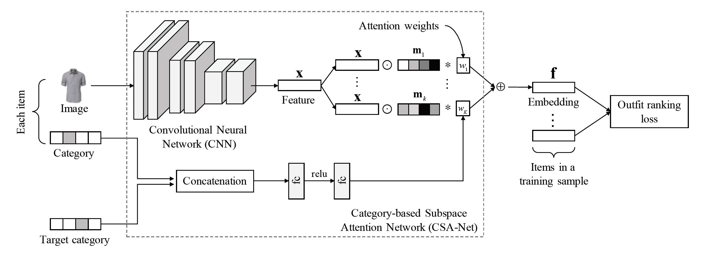

# Fashion_Outfit_Complementary_Item_Retrieval
Fashion_Outfit_Complementary_Item_Retrieval

This repository implements the paper ["Fashion Outfit Complementary Item Retrieval"](https://openaccess.thecvf.com/content_CVPR_2020/papers/Lin_Fashion_Outfit_Complementary_Item_Retrieval_CVPR_2020_paper.pdf) published in CVPR2020.

## Requirements
* python3.6+
* pytorch 1.6.0
* others.

## Usage
training a model
```bash
python3 main.py --config config.yml
```

testing a model
```bash
Not implmented yet
```

## Architecture

## Results


## Comments
 In this implementation, the code is not tested yet. If you are interested in the paper and code, please make a pull request.  
## Reference
1. Dataset : https://github.com/mvasil/fashion-compatibility and https://github.com/xthan/polyvore
2. Learning-Similarity-Conditions : https://github.com/rxtan2/Learning-Similarity-Conditions
3. NN search : https://github.com/nmslib/hnswlib